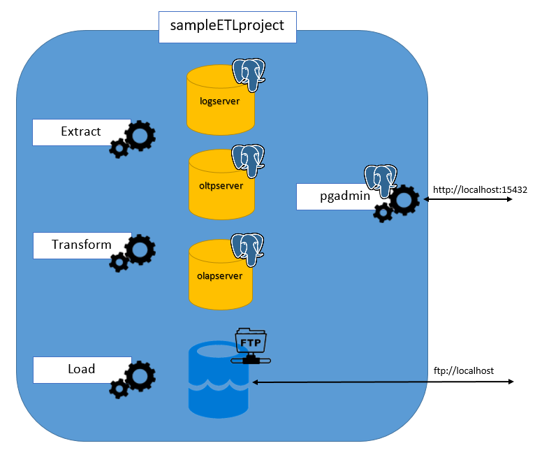

SAMPLE DATA ETL PROJECT

Here you can find some info about this project
- [How To Run](./README.md#how-to-run)
- [About Project Infrastructure](./README.md#about-project-infrastructure)
- [About Project Structure](./README.md#about-project-structure)
	- [EXTRACT](./README.md#extract)
	- [TRANSFORM](./README.md#transform)
	- [LOAD](./README.md#load)
- [About the codes](./README.md#about-the-codes)
	- [Extract](./README.md#extract-1)
    	- [Part 1](./README.md#part-1-check-time-interval)
    	- [Part 2](./README.md#part-2-extract-new-data)
    	- [Part 3](./README.md#part-3)
	- [Transform](./README.md#transform-1)
    	- [readData](./README.md#readdata)
    	- [transformData](./README.md#transformdata)
    	- [saveDataToOLTPDatabase](./README.md#savedatatooltpdatabase)
    	- [archivedNewExtactedData](./README.md#archivednewextacteddata)
	- [Load](./README.md#load-1)

# HOW TO RUN
Make a clone of project on your computer and open it


Inside project folder run:
```
docker-compose up -d
```

also pgadmin is accessible by: http://localhost:15432

in pgadmin 3 database servers can easily add by its names:
-   ***logserver***  
	-   port: ***5432***
	-   username:   ***postgresuser***
	-   password:   ***postgrespassword***
-   ***oltpserver***
	-   port: ***5433***
	-   username:   ***postgresuser***
	-   password:   ***postgrespassword***
-   ***olapserver***
	-   port: ***5434***
	-   username:   ***postgresuser***
	-   password:   ***postgrespassword***

FTP Server is accessible by: ftp://localhost

to see whats happening, just look inside ***logs*** table in ***Logs*** database in ***logserver***


---
---
# About Project Infrastructure

This project containerized with Docker
Whole Farm consists of:
- 3 postgres Database Server as:
	- Log Server
	- OLTP Server
	- OLAP Server
- 1 pgadmin to access Database servers from web
- 1 FTP Server as DATALAKE
- 3 python Application Server as:
	- Extract Server
	- Transform Server
	- Load Server

Inside [docker file](./docker-compose.yaml) each Database Servers has its own init.sql file to create required objects

Log Database Server [init file](./init_log.sql) create **Logs** database and logs table

OLTP Database Server [init file](./init_oltp.sql) create **extracted_data** database and required tables

OLAP Database Server [init file](./init_olap.sql) create **dw** database and required tables

Each application runs in its own server. application servers build through Dockerfiles inside its own subfolders.


---
---
# About Project Structure
This is a very simple Data ETL project.
In fintech that process crypto currencies stock market data, access and process crypto's data is a fundamental need.

gather crypto data from various resources, do some process on it and finally send and save them in data warehouses for further use is a Data Engineer job.
Here is a very simple data ETL project just to show how it can be happen.

This project consists of three main parts:

[Extract](./README.md#extract)
   > the part that extracts data from the data source

[Transform](./README.md#transform)
   > the part that transforms data to the required shape and saves it to the OLTP database

[Load](./README.md#load)
   > and finally the part that loads the data from the OLTP database to the OLAP data warehouse

Each project consists of following files:
- main.py
	- main module
- logger.py
	- responsible to saving (log) messages into logserver's Logs database
- fetcher.py `(only in extract project)`
	- responsible to connect to Web API and extract data from it
- filemanager.py
	- responsible to connect to FTP server and manage files
- oltp_server.py `(only in transform project)`
	- responsible to save data in OLTP Server
- loader.py `(only in load project)`
	- responsible to load data from OLTP database to Data Warehouse
- summary.csv `(only in extract project)`
	- save some info about newly extracted data for each symbol
- symbols.csv `(only in extract project)`
	- contains Symbols list to process

## EXTRACT
About data resource:

<table border>
<tr><td>Type</td><td>Web API</td></tr>
<tr><td>Authentication</td><td>API Key</td></tr>
<tr><td>Data Type</td><td>1 minute Crypto Candle Data</td></tr>
<tr><td>Call Interval</td><td>every 5 minutes</td></tr>
<tr><td>Address</td><td>https://finnhub.io</td></tr>
<tr><td>API Documentation</td><td>https://finnhub.io/docs/api</td></tr>
<tr><td>Libraries</td><td>https://finnhub.io/docs/api/library</td></tr>
</table>

Crypto currency symbols simply stores in [symbols.csv](./extract/extract_project/symbols.csv). you can add more currencies in the specified format to this file.

After reading the names of the symbols from the above file, a thread creates for each one, so, extracting data from Web API executes in parallel.

after extraction, each thread stores extracted data to the corresponding .csv file in **files** folder and also stores **last record's timestamp** to [summary.csv](./extract/extract_project/summary.csv) file for the next extraction round (extract records after last stored timestamp)

Finally, all new extracted files are sent to an FTP Server **(DataLake)** inside **fromapi1min** folder and removed from the **files** folder.


## TRANSFORM

**TRANSFORM** part of the project reads all new extracted .csv files from **DataLake**
and Then transforms Data mostly via ***simpledataengineeringtoolkit*** library that is also accessible from [here](https://pypi.org/project/simpledataengineeringtoolkit/) as the main library to help data engineers reshape or transform data.
you can simply use this library by

```
pip install simpledataengineeringtoolkit
```

Library source code is also available [here](https://github.com/karrabi/simpledataengineeringtoolkit)

And finally store all data in an OLTP database.

## LOAD

In **LOAD** part, first of all, the **Dimension Tables** in the OLAP database update with new data, and then all new records in the OLTP database load to the OLAP database **Fact Tables**

---
---
# About the codes


## EXTRACT
The **Extract** Code has 2 main part:
1. Check Time Interval
2. extract new Data
3. send Data to DataLake

### Part 1 (Check Time Interval):

1. Read List of symbols

```python
def retriveSymbols():
	symbols = pd.read_csv('symbols.csv')
	return symbols
```
2. Login to FTP Server through `filemanager >> Login`


3. A forever loop continuously checks if we are at the beginning of a 5 min period to start extracting new Data through **run()** function and then move newly extracted data to DataLake (FTP Server in here)

```python
	while True:
    	now = int(time.time())
    	if now % 300 == 0:
        	run( ... )
        	...
        	fm.moveFilesToDataLake( ... )
```

inside **run()** function, a for iterator iterate over symbols list; for each symbol first determined last extracted timestamp through:
```python
def retrive_from(symbol):
	history = pd.read_csv('summary.csv')
	history = history[history['symbol']==symbol]
	if history.shape[0] > 0:
    	return max(history['to']) + 1
	else:
    	return int(time.time()) - 8053600
```
function and then create an object of CryptoFetcher class and append it to threads list

> In ***retrive_from*** function, if a symbol has history data inside **summary.csv** file then the last timestamp is read from it and the function returns the last timestamp plus one to prevent record duplication in new data request otherwise if the symbol has no data in **summary.csv** file then the function assumes that the symbol is newly added to project and return a timestamp corresponding to about 90 days ago to retrieve historical data requires for further processes

after all objects create for all symbols, all thread joins the main thread

### Part 2 (extract new Data):

**run** function iterate over ***Symbols*** list and create an object of **CryptoFetcher** for each symbol.

[**CryptoFetcher**](./extract/extract_project/fetcher.py) is a Thread base Object that connect to the [Finnhub](https://finnhub.io) web API and download specific Symbol Candle Data from it.

Then stores the Downloaded Data as ***.csv*** file with the Symbol name followed by start timestamp and end timestamp as the filename. _(e.g.  BINANCE-1INCHUSDT_1668093311_1668093300.csv)_

file is stored in ***/files*** folder.

### Part 3
After All Data Extracted from Web API and stored as ***.csv*** files and then **moveFilesToDataLake** module sent all newly created files to DataLake _(FTP Server in here)_
```python
def moveFilesToDataLake(path):
	files = next(walk(path), (None, None, []))[2]
	for file in files:
    	SendFile( ... )
```
```python   
def SendFile( ... ):
	...
	with open(path + filename, 'rb') as file:
    	FTP.storbinary('STOR ' + filename, file)
```
After sending each file to DataLake, it delete the file from local **files** folder:

```python
	os.remove(path + filename)   
```
before try to send or receive the file to and from FTP Server, the app always checks the FTP connection and current directory:

```python
def Login():
	global FTP
	...
    	FTP = ftplib.FTP(FTP_HOST, FTP_USERNAME, FTP_PASSWORD)
    	FTP.cwd('fromapi1min')
	...
```

# TRANSFORM
In ***Transform project*** inside a forever loop, `filemanager >> listNextExtractedFile` looking for newly extracted files from ***Extract project*** and if find any then start to do following processes to new files:

1. read all new files content ([readData](./README.md#readdata))
2. transform data to especific format and conditions ([transformData](./README.md#transformdata))
3. send data to OLTP Database ([saveDataToOLTPDatabase])
4. archive listed new files ([archivedNewExtactedData])

more details:
- listNextExtractedFile
first of all it creates a list of all new extracted files inside FTP:
```python
def readNewExtractedFiles(path):
	filesls = []
	...
	filesls = FTP.nlst()
	...
	return filesls
```

Then it creates a second list of files with a specific pattern (e.g. All files start with `BINANCE-1INCHUSDT`) inside DataLake (FTP Server in here)
the process is as follows:
	-   read the very first file in FTP
	-   read all similar files base on the filename
	-   returns a list of files with of same `Symbol name`
then the second list returns for further processes.

### readData:
Download each file in list to local machine **(via `filemanager >> RetriveFile`)** and then appends its content to **new_data** Pandas DataFrame.
Finally returns the **new_data**.

### transformData:
This function uses simpledataengineeringtoolkit library to do:
1. Checks the Data Values through `ValueChecker` class:
	- _CheckFloatValues_ for 4 columns of Data
	- _CheckUnixTimestampValues_ of 1 column of Data
2. Checks columns through `ColumnChecker` class:
	- _CheckNecessaryColumns_ of Data
3. Cleans data through `ColumnCleaner` class:
	- _RemoveUnnecessaryColumns_ of Data
4. Cleans the Data Values through `ValueCleaner` class:
	- _RemoveDuplicateValues_
	- _RemoveNanValues_

Then After all data Checking and Cleansing is done, It resamples new clean data
- to 5 minutes resolution
- add two new properties to data based on **resolution** and **Symbol** to 5 min resolution Data
- rename all columns of 5 min resolution Data to required standard names (via `__monolithColumns(...)`)
- add two new properties to data based on **resolution** and **Symbol** to original (1 min resolution) Data
- rename all columns of original Data to required standard names (via `__monolithColumns(...)`)
- Finally union all Data of two resolutions and returns it
```python
	fiveMinResData = resampleDataToFiveMin(dataframe=new_data)
    
	__monolithColumns(data_frame=fiveMinResData)
    
	fiveMinResData['symbol'] = symbol_name
	fiveMinResData['resolution'] = '5min'
    
	__monolithColumns(data_frame=new_data)

	new_data['symbol'] = symbol_name
	new_data['resolution'] = '1min'
    
	new_data = new_data.append(fiveMinResData, ignore_index=True)
    
	return new_data
```
### saveDataToOLTPDatabase
This function Save the given DataFrame to OLTP database through `oltp_server >> save_to_database`

### archivedNewExtactedData
This function first select all files that successfully retrieved from FTP and make a list of them:
```python
next_new_files = [x for x in next_new_files if x not in ignored]
```
and then send all files in the list to archive through `filemanager >> archiveFiles`

> Also there is an unused function as `` to save the transformed Data to a CSV file with a specific filename. It creates a filename by combining of Symbol Name, lowest timestamp, and highest timestamp of the Data, and then saves the Data to ***.csv*** format.
```python
def saveDataToCSVFile(symbol_name, transformed_data):
	_from = min(transformed_data['timestamp'])
	_to = max(transformed_data['timestamp'])
	filename = '{}_{}_{}.csv'.format(symbol_name, _from, _to)
	transformed_data.to_csv('{}{}'.format(TEMP_PATH,filename))
	fm.SendFile(TRANSFORMED_PATH, TEMP_PATH,filename)
```

# LOAD
In this sub-project inside a forever loop, checks if the current time is 58th minutes of an Hour then:
1. symbols and resolutions Dim tables of Data Warehouse updates through
	- update_dim_symbols
	```sql
    	INSERT INTO dim_symbols (symbol)
        	select distinct(symbol) from oltp_extracted_candles
        	where symbol not in (
            	select symbol from dim_symbols
            	);
	```
	- update_dim_resolutions
	```sql
    	INSERT INTO dim_resolutions (resolution)
    	select distinct(resolution) from oltp_extracted_candles
    	where resolution not in (
        	select resolution from dim_resolutions
        	);
	```
2. Data loads from OLTP database (`extracted_data`) to OLAP database (`dw`) through the following SQL Query:
```sql
INSERT INTO public.fact_candles(
	open, high, low, close, volume, symbol_id, resolution_id, "timestamp")
select
oec.open,
oec.high,
oec.low,
oec.close,
oec.volume,
ds.id as symbol_id,
dr.id as resolution_id,
oec.timestamp
from
oltp_extracted_candles as oec
left outer join
dim_symbols as ds
on
oec.symbol = ds.symbol
left outer join
dim_resolutions as dr
on oec.resolution = dr.resolution
where isloaded=False;

update
oltp_extracted_candles
set isloaded=True
where isloaded=False;
```
